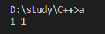

# static_cast

1. 内置类型转换

```cpp
int main()
{
    double a = 1.11;
    int b = static_cast<int>(a);
    bool c = static_cast<bool>(a);
    cout << b << " " << c << endl;
    return 0;
}
```



2. 也可以转换自定义类型。如果涉及到类，static_cast只能在有相互联系（继承）的类型间进行转换，**且不一定包含虚函数**

```cpp
class A
{};

class B : public A
{};

class C
{};

void main()
{
    A *pA = new A;
    B *pB = static_cast<B*>(pA); // 编译不会报错, B类继承于A类
    pB = new B;
    pA = static_cast<A*>(pB); // 编译不会报错, B类继承于A类
    C *pC = static_cast<C*>(pA); // 编译报错, C类与A类没有任何关系。error C2440: “static_cast”: 无法从“A *”转换为“C *”
}
```