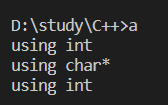

# 隐式类型转换

1. 内置数据类型

```cpp
int a = 1;
double b = 2;
double c = b + a; //a自动转换为double
```

满足低精度向高精度的转换。
如果是高精度转低精度的话会有编译器警告。

2. 自定义数据类型

```cpp
class Type{
public:
    Type(int n){ cout << "using int " << endl; }
    Type(const char *a){ cout << "using char* " << endl; }
};

int main()
{
    Type a = 1;
    Type b = "AB";
    Type c = 'a';
    return 0;
}
```


自动调用了构造函数，形成隐式类型转换。

+ 使用[`explicit `](./explicit.md)修饰构造函数时，可以防止隐式转换和复制初始化