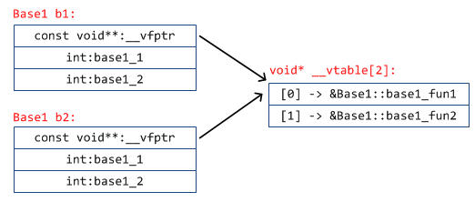
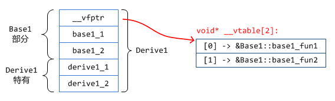
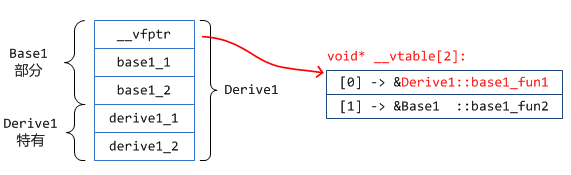
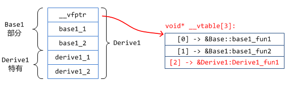
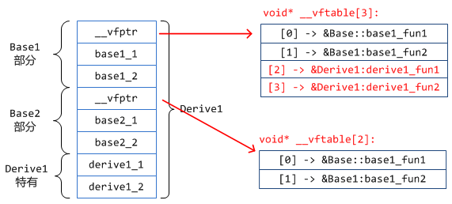
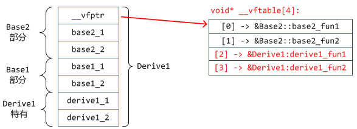

# vptr_vtable


+ 虚函数表
> **每个使用虚函数的类（或者从使用虚函数的类派生）都有自己的虚拟表**
+ 继承中谁有虚表谁放派生类开头
+ 虚函数指针
> 在含有虚函数类的对象中指向虚函数

# 结构


```cpp
#include<bits/stdc++.h>
using namespace std;

typedef void (*Fun)();

class Base{
public:
    virtual void fun1(){
        cout << "Base::fun1" << endl;
    }
    virtual void fun2(){
        cout << "Base::fun2" << endl;
    }
};

class Derived: public Base{
public:
    void fun1(){
        cout << "Derived::fun1" << endl;
    }
};

Fun getAddr(void *obj, unsigned int offset){
    cout << "==============" << endl;
    /*
    class              vtable
    +------+         +------+
    | vptr | 0 --->  | fun1 | 0
    +------+         +------+
                     | fun2 | 8
                     +------+
    */
    void *vptr_addr = (void *)*(unsigned long long *)obj;
    printf("vptr_addr: %p\n", vptr_addr);
    void *func_addr = (void *)*((unsigned long long *)vptr_addr+offset);
    printf("func_addr: %p\n", func_addr);
    return (Fun)func_addr;
}

int main(){
    Base *pt = new Derived();
    Fun f1 = getAddr(pt, 0);
    (*f1)();
    Fun f2 = getAddr(pt, 1);
    (*f2)();
    return 0;
}
```
```
==============
vptr_addr: 00000000004099f0
func_addr: 0000000000407b00
Derived::fun1
==============
vptr_addr: 00000000004099f0
func_addr: 0000000000407aa0
Base::fun2
```

## 仅有一个虚函数类对象

```cpp
class Base1
{
public:
    int base1_1;
    int base1_2;

    virtual void base1_fun1() {}
};
```

sizeof(Base1)|12
-|-
offsetof(__vfptr)|0
offsetof(base1_1)|4
offsetof(base1_2)|8


## 多个虚函数类对象

```cpp
class Base1
{
public:
    int base1_1;
    int base1_2;

    virtual void base1_fun1() {}
    virtual void base1_fun2() {}
};
```

实例化两个，分别为b1, b2


## 单继承，派生类内无虚函数

```cpp
class Base1
{
public:
    int base1_1;
    int base1_2;

    virtual void base1_fun1() {}
    virtual void base1_fun2() {}
};

class Derive1 : public Base1
{
public:
    int derive1_1;
    int derive1_2;
};
```



## 单继承，虚函数覆盖

```cpp
class Base1
{
public:
    int base1_1;
    int base1_2;

    virtual void base1_fun1() {}
    virtual void base1_fun2() {}
};

class Derive1 : public Base1
{
public:
    int derive1_1;
    int derive1_2;

    // 覆盖基类函数
    virtual void base1_fun1() {}
};
```



## 单继承有虚函数无覆盖

```cpp
class Base1
{
public:
    int base1_1;
    int base1_2;

    virtual void base1_fun1() {}
    virtual void base1_fun2() {}
};

class Derive1 : public Base1
{
public:
    int derive1_1;
    int derive1_2;

    virtual void derive1_fun1() {}
};
```



## 多继承，皆有虚函数，有覆盖

```cpp
class Base1
{
public:
    int base1_1;
    int base1_2;

    virtual void base1_fun1() {}
    virtual void base1_fun2() {}
};

class Base2
{
public:
    int base2_1;
    int base2_2;

    virtual void base2_fun1() {}
    virtual void base2_fun2() {}
};

// 多继承
class Derive1 : public Base1, public Base2
{
public:
    int derive1_1;
    int derive1_2;

    // 基类虚函数覆盖
    virtual void base1_fun1() {}
    virtual void base2_fun2() {}

    // 自身定义的虚函数
    virtual void derive1_fun1() {}
    virtual void derive1_fun2() {}
};
```



## 多继承，第一个基类无虚函数(无虚表)

```cpp
class Base1
{
public:
    int base1_1;
    int base1_2;
};

class Base2
{
public:
    int base2_1;
    int base2_2;

    virtual void base2_fun1() {}
    virtual void base2_fun2() {}
};

// 多继承
class Derive1 : public Base1, public Base2
{
public:
    int derive1_1;
    int derive1_2;

    // 自身定义的虚函数
    virtual void derive1_fun1() {}
    virtual void derive1_fun2() {}
};
```

