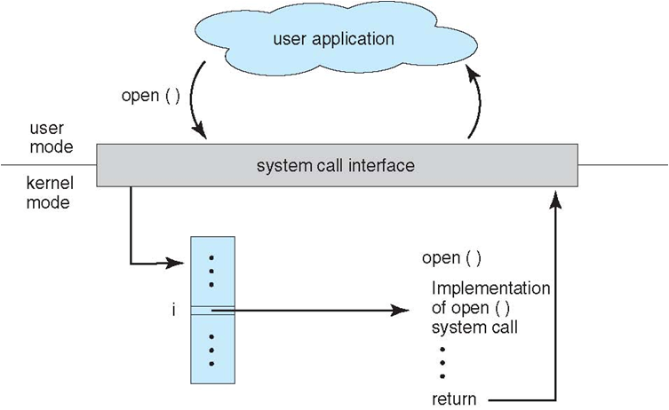

# 概述

## 进程管理

+ 进程控制、进程同步、进程通信、死锁处理、处理机调度等。

## 内存管理

+ 内存分配、地址映射、内存保护与共享、虚拟内存等。

## 文件管理

+ 文件存储空间的管理、目录管理、文件读写管理和保护等。

## 设备管理

+ 完成用户的 I/O 请求，方便用户使用各种设备，并提高设备的利用率。
+ 主要包括缓冲管理、设备分配、设备处理、虛拟设备等。

## 系统调用

+ 如果一个进程在用户态需要使用内核态的功能，就进行系统调用从而陷入内核，由操作系统代为完成。



如果一个进程在用户态需要使用内核态的功能，就进行系统调用从而陷入内核，由操作系统代为完成。

## 大内核和微内核

### 大内核

+ 内核态

大内核是将操作系统功能作为一个紧密结合的整体放到内核。

由于各模块共享信息，因此有很高的性能。

### 微内核

+ 用户态

由于操作系统不断复杂，因此将一部分操作系统功能移出内核，从而降低内核的复杂性。移出的部分根据分层的原则划分成若干服务，相互独立。

在微内核结构下，操作系统被划分成小的、定义良好的模块，只有微内核这一个模块运行在内核态，其余模块运行在用户态。

因为需要频繁地在用户态和核心态之间进行切换，所以会有一定的性能损失。

## 中断分类

### 1. 外中断

由 CPU 执行指令以外的事件引起，如 I/O 完成中断，表示设备输入/输出处理已经完成，处理器能够发送下一个输入/输出请求。此外还有时钟中断、控制台中断等。

### 2. 异常

由 CPU 执行指令的内部事件引起，如非法操作码、地址越界、算术溢出等。

### 3. 陷入

在用户程序中使用系统调用。

```
转载自：[CYC2018](https://cyc2018.github.io/CS-Notes/#/notes/计算机操作系统%20-%20概述?id=_2-内存管理)
```