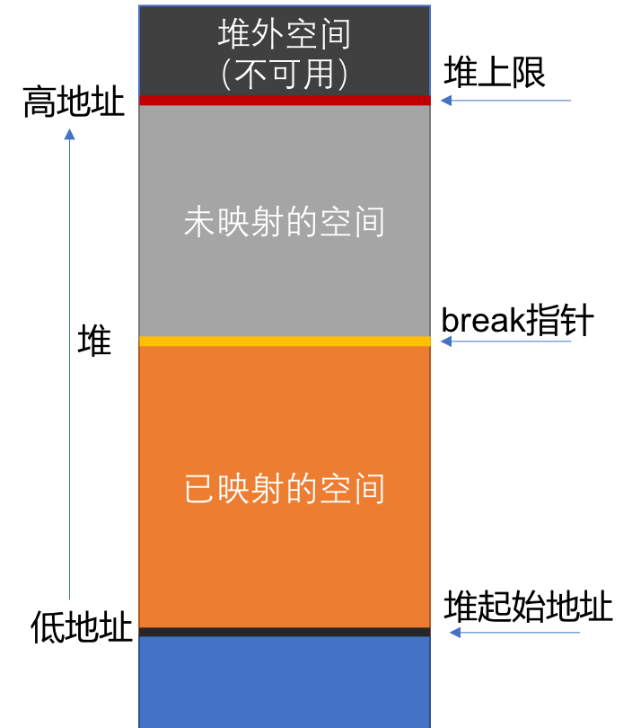
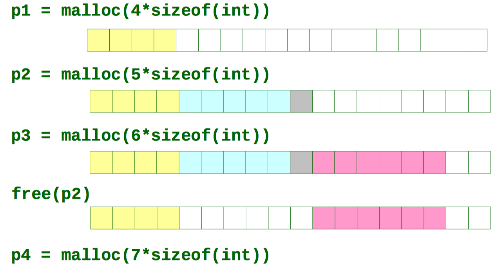
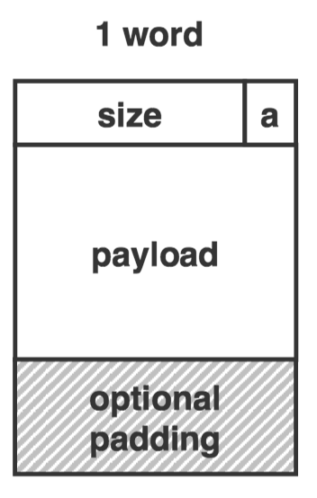
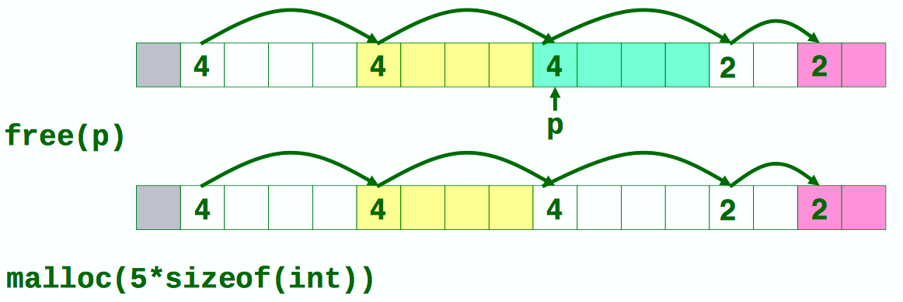
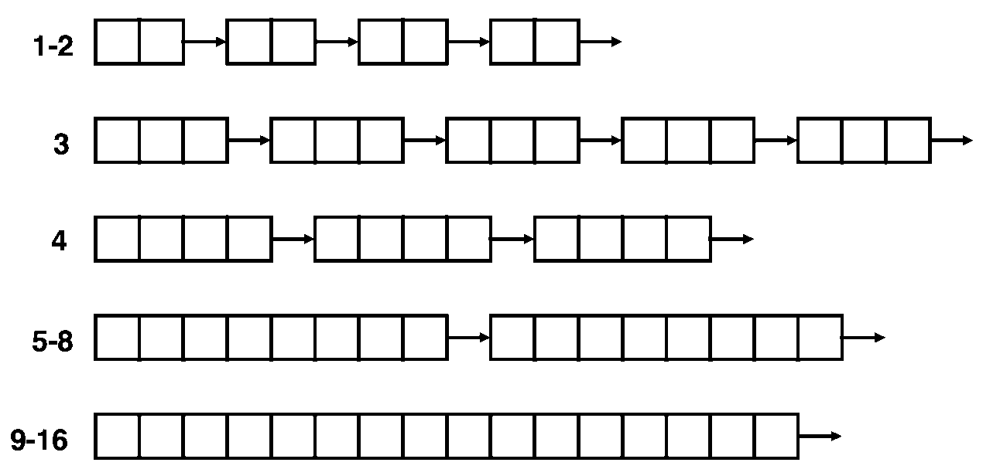

# E.内存分配器

curtainf2f.github.io/viki

时间限制：30.0秒

空间限制：256MB

**本题仅支持 C、C++和 Java语言。**

**题目背景**

动态内存分配器（dynamic memory allocator），又称为堆内存分配器，开发者通过动态内存分配（例如  `malloc`）来让程序在运行时得到虚拟内存，动态内存分配器会管理一个虚拟内存区域，称为堆（heap）。分配器以块（block）为单位来维护堆，可以进行分配或者释放操作。常见的分配器有两种基本风格：

- 显式分配器：需要开发者显式地释放任何已经分配的块。例如 C 语言中的 `malloc` 和 `free`。

- 隐式分配器：开发者只负责分配块，但是不负责手动释放已经分配的块。这就要求当分配器检测到一个已分配块不再被程序使用时，就释放这个块。这类分配器也被称为垃圾收集器，例如 Java 中的垃圾收集机制。


**题目描述**

本题需要你在我们模拟的“内存”系统下，借助我们提供的一些辅助函数，从我们提供的“堆内存”空间中请求地址空间，设计与实现一个显式动态内存分配器，即实现自己版本的  `malloc`、`free`、`realloc` 函数，从而被最终测试程序调用。

本题中你只需要考虑从我们提供的“堆”区域分配申请与管理内存，堆自低地址向高地址增长，本题中你可以通过我们提供的 `mem_sbrk` 函数调用来增加实际可用的堆大小。并且为了简化问题，本题中的堆区域只会向上扩展，不会缩小（即 `mem_sbrk` 的参数 **incr**只能为非负整数）。堆的大小不超过  $100\times2^{20}$ 字节（$100$ MB）。

你可能还需要一些将用于管理“堆”中内存的数据信息存放到我们提供的“堆”区域中，本题的内存空间限制为{{ prob['memory limit'] }}，其中我们用于评测的框架会使用的内存不超过 240 MB，因此我们建议你不要在解题文件中构造较大的全局 `array` 或者 `tree`，但可以将相应用于管理“堆”中内存的数据合理安排并存放在我们提供的“堆”区域中。

其中对堆区域的管理示意如下图：


我们维护了一个 `break`“指针”，这个“指针”指向堆空间的某个地址。从堆的起始位置到 `break` 之间的地址空间为**映射好的**，可以供进程访问的；而 `break` 之上的，是**未映射的**地址空间，如果访问这段空间则程序会报错。**注意**，在实现过程中你不可以直接操作  `break`“指针”，只能通过我们提供的辅助函数进行操作。

因此要增加一个进程实际的可用堆大小，就需要将 `break` 指针向高地址移动。在本题中，当现有可用堆大小不足以满足当前 `malloc` 调用的需求时，你可以通过调用 `mem_sbrk(int incr)` 将 `break` 指针从当前位置向上移动  **incr**指定的增量，从而增加可用堆的大小。当然，本题中可用的堆空间并不是无限的，当你申请的空间超过我们的上限时，则会失败。这就要求你需要合理安排好堆内存的使用。

此外为了让你更方便的理解相关知识与解决这一问题，我们还提供了一系列与内存分配器相关的学习资料供你参考，其中既包括基本原理的阐述，也包括了一些相关的研究论文等等。

~~（当然我们并不保证这些资料都能很好的用到。）~~

##  任务目标

（以 **C** 版本为例进行说明，**C++**、**Java** 版本要求类似。）

你需要做的是完成在  `solve.c` 中的以下几个函数：

```C
int my_init(void);
void *my_malloc(size_t size);
void my_free(void *ptr);
void *my_realloc(void *ptr, size_t size);
```

上述函数的要求如下：

- `my_init`：在这里执行所有你需要的初始化操作，例如分配初始的堆区域。若成功则返回 $0$；否则返回 $-1$。
    - 注意在这里不允许调用 `utils.h` 中的 `mem_init` 函数。
    - 测试程序对每个测点进行一次测试时，都会调用你的 `my_init` 函数，进行初始化操作。
- `my_malloc`：在系统中分配大小**至少**为 `size` 的连续可用的空间，若分配成功，则返回一个指向这段可用空间起始地址的指针；否则返回一个 `NULL` 指针。（Java 版本中返回值为具体的地址值）
- `my_free`：释放 `ptr` 指向的内存区域（`ptr` 保证是通过 `my_malloc` 或 `my_realloc` 分配得到的），没有返回值。`my_free(NULL)` 什么都不做。
- `my_realloc`：重新分配给定的内存区域，成功时，返回指向新分配内存的指针；失败时，返回空指针。`ptr` 所指向的区域必须是之前为 `my_malloc`  或 `my_realloc()` 所分配，并且仍未被释放。根据传入参数的不同，该函数有不同的表现：
    - `ptr` 为 `NULL` 时，等同于 `my_malloc(size)`。
    - `size` 为 `0` 时，等同于 `my_free(ptr)`，返回值应为 `NULL`。
    - `ptr` 不为 `NULL` 且 `size` 不为 `0` 时，你可以选择就地扩张或收缩 `ptr` 所指向的已分配的内存区域（如果可行的话），内存的内容在新旧大小中的较小者范围内保持不变；若扩张范围，则内存空间新增部分的内容是未初始化的。你也可以选择直接新分配一个大小为 `size` 字节的新内存块，并从原分配的内存区域中复制大小等于新旧大小中较小者的数据到新分配的内存区域中，然后释放原分配的内存区域；同样地，内存空间新增部分的内容是未初始化的。
    - **注意：**调用成功后分配的地址空间不能和其他时刻 `my_malloc` 或者 `my_realloc` 分配的空间有重叠部分，并且不能超出整个“堆”空间。

`utils.c` 中模拟了一个简单的内存系统。你函数分配的所有堆空间应当通过这个系统申请。具体的，当你需要更大的堆空间时，你的函数应当调用下列函数进行操作：

- `void *mem_sbrk(int incr)`：将堆向上扩展 `incr` 个字节（注意本题中 `incr` 只能为非负整数）。如果成功则返回一个指向分配的新的堆空间的首地址的指针（即返回 `break` 指针在该次调用前的值）；如果堆空间达到了上限，则会失败，此时返回 `(void*) -1`。注意：你最终通过这个方法获取到的堆空间总大小将影响到你的得分。

在这个系统中，你的函数还可以调用下列函数来得到相应的信息：

- `void *mem_heap_lo()`：返回指向堆的第一个字节的指针。
- `void *mem_heap_hi()`：返回指向当前可用堆的最后一个字节的指针。
- `size_t mem_heapsize()`：返回当前的堆大小。
- `utils.c` 中的上述 $4$ 个函数在评测时的代码和你看到的相同，你实现中调用这些函数的运行时间都会计入你的程序耗费时间。

### 注意事项：
- `my_malloc` 和 `my_realloc` 返回的地址必须是 8 字节对齐的，即地址值模 8 余数为 0。
- `my_malloc` 和 `my_realloc` 调用成功后分配的地址空间不能和其他时刻 `my_malloc` 或者 `my_realloc` 分配的空间有重叠部分，并且不能超出整个“堆”空间。
- 我们需要你实现的 `my_malloc` 和 `my_realloc` 能够尽可能保证每次都能分配成功，在评测过程中需要你实现的内存分配器对测试文件中每一个请求都能成功分配并返回。当然你也必须处理失败的情况，即返回 `NULL` 指针的情况。


## 解题框架

本题我们提供三种语言解题框架，建议使用 **C 解题框架**。

### 提醒
- 下发的框架和最终实际测评的框架并不完全相同，但是基本功能是一致的，你最终只需要提交你所需要填写的代码文件。你可以在解题过程中修改其他文件用于调试，但请在最终提交前确认你的解题代码在原始版本下能否编译运行成功。
- 下发框架中包含了 `solve.c/solve.cpp/Solve.java` 简单实现的解题代码，旨在让你熟悉框架，不代表你需要使用这些代码或参考其中的实现。这些代码并**不能**通过所有的测试点，你应该编写自己的代码。
- 下发框架中包含了一些测试文件，这些测试文件并**不是**最终用于评测的文件，但是最终评测的文件与你能看到的测试文件基本是同类型的（同类型是指：申请、释放内存的指令序列模式类似等）。因此建议你在本地通过所有文件的正确性测试之后再提交代码。
- 你需要在评测网站上提交你的 `solve.c/solve.cpp/Solve.java`。网站不能提交多个工程文件，也不要提交其他框架代码。只有你提交到网站的文件会作为评分的依据，本地的任何测试结果均不作为评分依据。

### C \ C++ 解题框架

你需要在 `solve.c | solve.cpp` 中实现 `my_init()`，`my_malloc()`，`my_free()`，`my_realloc()` 函数。

具体地，在所给的框架中，包含以下文件和文件夹：

- `Makefile`：用于编译，生成可执行文件 *tester*。
- `tester.c | tester.cpp`：测试程序的入口。运行时会读取相应的测试点，按照操作指令调用你实现的函数进行评测。
- `utils.c | utils.cpp, h`：一些工具函数。
- `solve.h`：`my_init()`，`my_malloc()`，`my_free()`，`my_realloc()` 函数声明。
- `solve.c | solve.cpp`：你所需要填写的代码文件，提交时仅能提交该文件。其中：
    - 你需要实现  `my_init()`，`my_malloc()`，`my_free()`，`my_realloc()` 函数。
    - 你可以在该文件中添加你可能要用到的变量、函数和其他代码。
- `short1, short2`：用于测试你程序的两个较小的测试样例，便于你调试。
- `data`：一些你可以用于本地测试的测试文件。

在答题时，有以下**注意事项**：

- 提交的代码运行后务必不能输出任何额外信息，即你最终提交的 `solve.c | solve.cpp` 文件中不应该包含 `printf` 类似的输出。否则该次提交得分为 $0$。

**测试程序运行方法：**

你可以在下发框架目录下，在终端中执行 `make` 命令编译代码。

编译成功后，直接执行 `./tester`，即可进行完整测试，并得到相应的输出，可选的参数如下：

- `-f <testfile>`：进行一个特定的测试，输出正确性、时间等信息。
- `-c <testfile>`：进行一次特定的测试，仅评测正确性，用来检测正确性很方便。
- `-v`：对每一个测试点进行测试时输出额外信息。
- `-h`：输出命令行参数。

### Java 解题框架

你需要在 `Solve.java` 中实现 `myInit()`，`myMalloc()`，`myFree()`，`myRealloc()` 函数。

具体地，在所给的框架中，包含以下一些文件/文件夹：

- `src/Makefile`：用于编译，生成 *.class* 文件。
- `src/MyMain.java`：测试程序的入口。运行时会调用 `Tester` 类，读取相应的测试点，按照操作指令调用你实现的函数进行测评。 
- `src/MyUtils.java`：一些工具函数。
- `src/Tester.java`：`Tester` 类，用于读取相应的测试点并进行测评。
- `src/Solve.java`：你所需要填写的代码文件，提交时仅能修改该文件。其中：
    - 你需要实现 `myInit()`，`myMalloc()`，`myFree()`，`myRealloc()` 函数。
    - 你可以在该文件中添加你可能要用到的变量、函数和其他代码。
- `Readme.pdf`：针对 Java 框架的额外说明，请**务必**阅读。
- `src/short1 src/short2`：用于测试你程序的两个较小的测试样例，便于你调试。
- `data`：一些你可以用于本地测试的测试文件。

在答题中，有以下**注意事项**：

- 提交的代码运行后务必不能输出任何额外信息，即你最终提交的 `Solve.java` 文件中不应该包含 `println` 类似的输出。

**测试程序运行方法：**

你可以在下发框架的 `src` 目录下，在终端中执行 `make` 命令编译代码。

编译成功后，直接执行 `java MyMain`，即可进行完整测试，并得到相应的输出，可选的参数如下：

- `-f <testfile>`：进行一次特定的测试，输出正确性、时间等信息。

- `-c <testfile>`：进行一次特定的测试，仅评测正确性，用来检测正确性很方便。

- `-v`：对每一个测试点进行测试时输出额外信息。

- `-h`：输出命令行参数。


**输入格式**

本题的测试程序会运行一系列的测试点，按照其中的操作指令，调用你自己实现的动态内存分配器执行相应的操作，并进行正确性检验以及相应性能指标的统计。

测试点的输入是文本格式，前两行格式如下：
```C
[num_ids]         /* number of request id's */
[num_ops]         /* number of operations */
```
从第 $3$ 行开始每行对应着一个具体的操作指令，分别对应 `malloc`、`free` 和 `realloc` 中的一种操作，格式如下：
```C
a [id] [size]  	/* ptr_[id] = malloc([size]) */
r [id] [size]  	/* realloc(ptr_[id], [size]) */ 
f [id]          /* free(ptr_[id]) */
```
其中 `size` 为在 $[0, 2^{26} ]$ 之间的整数。

一个非常简单的测试点示例如下：

```shell
3
8
a 0 512
a 1 128
r 0 640
a 2 128
f 1
r 0 768
f 0
f 2
```

其中有些测试点中会出现 `f  -1`，表示实际为执行 `free(NULL)`。以及测试点中可能出现下述形式的片段：

```shell
a 34 1234
a 33
a 23
a 30
f 49
a 38
a 17 
a 35
a 31
a 43 600
```

这种形式实际可以理解成下述形式：

```shell
a 34 1234
a 33 1234
a 23 1234
a 30 1234
f 49
a 38 1234
a 17 1234
a 35 1234
a 31 1234
a 43 600
```

~~（其实你不需要过多研究测试点的格式，因为你需要编写的内存分配器不需要处理输入数据。）~~


**输出格式**

你正确实现内存分配器后，编译并运行测试程序，会输出相应的测试结果，其中包括正确性、堆利用率以及耗费时间等指标信息。对于某个测试点，如果你的程序未能通过正确性检验，则并不会输出利用率等信息。其中堆利用率的输出为 $(0, 1)$ 之间的小数，时间的输出为以秒为单位的小数，两者都保留到小数点后 $6$ 位。

### 堆利用率
**堆利用率**是测试程序调用你实现的 `my_malloc`、`my_realloc` 等函数的过程中请求分配的“内存”累计总量的最大值与你的分配器最终所使用的堆大小之比。你需要尽量减少堆内碎片化程度从而让堆利用率提高。

例如对于下面的测试文件：

```shell
3
8
a 0 512
a 1 128
r 0 640
a 2 128
f 1
r 0 768
f 0
f 2
```
测试程序向你的程序请求分配的“内存”累计总量最大值为：896 Bytes（$512 + 128 + (640 - 512) + 128$）。

假如你实现的分配器通过调用 `mem_sbrk` 函数申请的堆大小为：1024 Bytes，则堆利用率此时为：$\frac{896}{1024}=0.875$。

### 耗费时间

**耗费时间**是指测试程序读取一个测试文件的指令序列后，按照其中的操作指令，依次调用你实现的动态内存分配器执行所有相应的操作所用的总时间，用 $t$ 表示。

### 样例输出

一个可能的测试运行结果如下：

```
Results for your malloc:
  id     valid      util      secs filename
   0       yes  0.857824  0.028609 1.in
   1       yes  0.761353  0.000757 2.in
   2       no          -         - 3.in
   
```

上述输出表示：你实现的代码可以通过 `1.in` 的测试，其中堆利用率为 $0.857824$，耗费时间为 $0.028609$ 秒（`2.in` 测试文件类似）。但是你的代码并不能通过 `3.in` 的测试。


**评分方式**

本题的分数分为两部分：正确性分数和性能分数。

正确性分数满分为 $20$ 分，包括 $20$ 个测试点。若选手的程序能够在给定的时间、空间限制下正确处理**全部**测试点，则得 $20$ 分，否则得 $0$ 分。

这里的时间限制即评测网站上显示的时间限制，与前文所述的**耗费时间**不同，这里的时间限制**包括**我们提供的框架运行的时间，而**耗费时间**不包括。对于每个测试点，我们保证我们的框架运行总时长不超过 4 s，因此可以认为只要你的函数每个测试点的运行时长不超过 6 s，就能保证不会超过时间限制。

性能分数满分为 $80$ 分，包括 $20$ 个测试点，每个测试点的满分是 $4$ 分。若正确性分数为 $0$ 分，那么性能分数也为 $0$ 分；否则每个测试点的分数计算方式如下：

对于第 $i$ 个测试点，设 $u_i$ 为选手程序的堆利用率，$t_i$ 为选手程序的耗费时间，$U_i$ 为所有选手程序运行此测试点堆利用率的最大值，$T_i$ 为所有选手程序运行此测试点耗费时间的最小值，并取：
$$
\alpha_i=\frac{1-U_i}{1-u_i}
$$

$$
\beta_i=\frac{T_i}{t_i}
$$

那么选手在该测试点的性能得分 $s_i$ 为：

$$
s_i=4 \times (0.7\alpha_i+0.3\beta_i)
$$

选手的性能分数为各测试点的性能得分之和，本题的得分为正确性分数和性能分数之和，共计满分 $100$ 分。


## 阅读材料

本题为了还提供了一些关于动态内存分配的阅读材料，你可以在下发文件夹中找到相应的文件，有选择性的进行学习。

这里对一些阅读材料进行简要的说明。

- `basic` 文件夹：该文件夹下主要提供了关于动态内存分配基本原理的一些资料，其中包括一些经典的综述论文、相关教材章节以及相关的 Slides 等。你可以通过学习该文件下的资料，掌握动态内存分配的基本模型与原理，从而能更轻松的解决本题。
- `advanced` 文件夹：该文件夹下主要提供了一些进阶的阅读材料，其中既包括例如实际环境中采用的 `tcmalloc`、`ptmalloc`、`jemalloc` 等算法与实现分析，也有诸如对针对实时系统进行优化的内存分配算法 `TLSF` 的介绍。你通过阅读学习其中的一些材料可能能够得到一些启发，从而更好更高效的解决本题。

[资料下载地址](http://history.ccfccsp.org.cn/ "资料下载地址")

# 以下为解题过程

## 需要解决的问题

**1.**



当申请p4空间时，从前往后找的第一块空闲内存块其实大小只有6*sizeof(int)，存不下7*sizeof(int)导致内存区域重叠导致错误

**解决方法**



在每个内存块之前记录该块所占用的内存大小，根据该内存大小进行指针移动，从而找到下一个块的内存大小

块的内存大小进行压缩，记录该块是否被使用，因为题面说明内存地址%8==0，所以我们的存块内存大小二进制后三位是没有用的，可以拿来储存该内存块是否被使用

**2.**



当free(p)之后，产生空闲内存块如图中 4->2 区域。 这块内存块可以容纳的下5*sizeof(int)的大小，但程序不会让它存到这个位置

**解决方法**


头尾皆维护该块的大小，要知道前一块内存的大小只需要读取该块内存前一个单位的数据进行偏移即可

这样我们就能知道该块内存前后是否空闲，并进行合并

## 优化（用少量空间换取时间）**

**1.显式空闲链表 提高时间效率**


用隐式空闲链表找空闲块时，会经常路过已经被申请的块，导致时间浪费，

显示链表在未被申请的内存中储存上一个未被分配的块以及下一个未被分配的块，减少搜索时间

**2.分离显式空闲链表**

为了提高获取空闲块时的时间效率，可以采用分离显式空闲链表
对于每个空闲的块，根据块大小进行分类，以达到优化时间速度的目的。



**3.平衡树**

将单次提取空闲块时间复杂度进一步压缩到O(logn)


# 代码

**分离显式链表**

```cpp
#include "solve.h"
#include <assert.h>
#include <limits.h>
#include <stdio.h>
#include <stdlib.h>
#include <string.h>
#include <unistd.h>
#include "utils.h"

// p 为指针， bp为块指针

// 扩充到 8 字节 align(1~8) = 8
#define ALIGNMENT 8
#define align(size) (((size) + (ALIGNMENT - 1)) & ~0x7)

// WSIZE = 4字节， DSIZE = 8字节
#define WSIZE 4
#define DSIZE 8

// 将size和alloc打包到一个word
#define pack(size, alloc) ((size) | (alloc))

// 读内存get 写内存put 类型:无符号数
#define get(p) (*(unsigned int *)(p))
#define put(p, val) (*(unsigned int *)(p) = (val))

// 获得块大小getSize，以及块是否被使用getAlloc
#define getSize(p) (get(p) & ~0x7)
#define getAlloc(p) (get(p) & 0x1)

// 获得块的头指针headerP，以及脚指针footerP
#define headerP(bp) ((char*)(bp)-WSIZE)
#define footerP(bp) ((char*)(bp) + getSize(headerP(bp)) - DSIZE)

// 获得下一块的指针nextBlockP 以及上一块的指针prevBlockP
#define nextBlockP(bp) ((char*)(bp) + getSize(((char *)(bp)-WSIZE)))
#define prevBlockP(bp) ((char*)(bp) - getSize(((char *)(bp)-DSIZE)))

// 获得链表下一块的指针getNextP 和 链表上一块指针getPrevP, 写入链表上一块指针setNextP，下一块指针setPrevP
#define getNextP(bp) (*(void**)((char*)bp + DSIZE))
#define getPrevP(bp) (*(void**)bp)
#define setNextP(bp, ptr) (getNextP(bp) = ptr)
#define setPrevP(bp, ptr) (getPrevP(bp) = ptr)

// 获取分离显式链表头getSeglist，以及写入分离显式链表头setSeglist
#define getSeglist(seg_list, i) (*(void**)((char*)seg_list + (i * DSIZE)))
#define setSeglist(seglist, i, ptr) ((getSeglist((char*)seg_list, i)) = ptr)

// 一个块最少需要的空间 头4 + 尾4 + 链表上一块指针8 + 链表下一块指针8 = 3 * 8 = 3 * DSIZE
#define MIN_BLOCK_SIZE (3 * DSIZE)

// 分离显式链表头数量
#define NUMBER_SEG_LIST 16

static void* heap_listp = 0;
static void* seg_list = 0;

// 扩展申请的块
static void* externHeap(size_t blockSize);
// 使用块并拆分块
static void place(void* bp, size_t asize);
// 添加空闲块到分离显式链表
static void* addFreeList(void *bp);
// 从分离显式链表中删除块
static void delFreeList(void *bp);
// 合并附近空闲块
static void* coalesceBlock(void *bp);
// 获取asize的块应该在哪个分离显式链表
static unsigned int getListNo(size_t asize);
// 寻找能放得下asize的块
static void *findBlock(size_t asize);

/**
 * 堆：
 * +---------------+
 * |空闲分离显式链表头| 
 * +---------------+
 * |    填充        |   4
 * +---------------+
 * |    序言块      |   4
 * +---------------+ <------heap_listp
 * |    序言块      |   4
 * +---------------+
 * |   已申请的块    |
 * +---------------+
 * |    结尾块      |   4
 * +---------------+
 * 
 * 
 * 块：
 * +---------------+
 * |   头(块大小)   |  4
 * +---------------+<------bp
 * |    前一个块    |  8
 * +---------------+
 * |    后一个块    |  8
 * +---------------+
 * |     填充      |
 * +---------------+
 * |   脚(块大小)   |  8
 * +---------------+
 * */

int my_init() {
    heap_listp = NULL;
    seg_list = NULL;
    if((seg_list = mem_sbrk(NUMBER_SEG_LIST * DSIZE)) == (void*)-1) return -1;
    for(int i = 0; i < NUMBER_SEG_LIST; i ++) setSeglist(seg_list, i, NULL);
    if((heap_listp = mem_sbrk(WSIZE*4)) == (void*)-1) return -1;
    put(heap_listp, 0); // 填充
    put((char*)heap_listp + WSIZE*1, pack(DSIZE, 1)); // 序言块
    put((char*)heap_listp + WSIZE*2, pack(DSIZE, 1)); // 序言块
    put((char*)heap_listp + WSIZE*3, pack(0, 1)); // 结尾块
    heap_listp = (char*)heap_listp + WSIZE*2;
    return 0;
}

void *my_malloc(size_t size) {
    // your code here,you can remove all the code below if you need.
    // 如果还没初始化则初始化
    if(heap_listp == NULL) my_init();

    if(size == 0) return NULL;

    void* bp;

    // 如果申请的空间小于内部碎片所要用的空间，则需要将大小开到最小空间
    size = align(size + DSIZE);
    if(size < MIN_BLOCK_SIZE) size = MIN_BLOCK_SIZE;
    // 如果有块可以重复利用，则使用该块
    if((bp = findBlock(size)) != NULL){
        place(bp, size);
        return bp;
    }
    // 申请空间使用
    if((bp = externHeap(size)) == NULL) return NULL;
    place(bp, size);
    return bp;
}

void my_free(void *ptr) {
    // your code here
    if(ptr == NULL) return;

    // 如果还没初始化则初始化
    if(heap_listp == NULL) my_init();

    size_t size = getSize(headerP(ptr));
    put(headerP(ptr), pack(size, 0));
    put(footerP(ptr), pack(size, 0));
    addFreeList(ptr);
}

void *my_realloc(void *ptr, size_t size) {
    // your code here,you can remove all the code below if you need.
    if(size == 0){
        my_free(ptr);
        return NULL;
    }
    if(ptr == NULL) return my_malloc(size);

    void* newPtr = my_malloc(size);
    if(newPtr == NULL) return NULL;

    size_t oldSize = getSize(headerP(ptr));
    if(size < oldSize) oldSize = size;
    
    memcpy(newPtr, ptr, oldSize);
    my_free(ptr);
    return newPtr;
}

// 扩展申请的块
static void* externHeap(size_t blockSize){
    void* bp;
    if((bp = mem_sbrk(blockSize)) == (void*)-1) return NULL;
    put(headerP(bp), pack(blockSize, 0));
    put(footerP(bp), pack(blockSize, 0));
    put(headerP(nextBlockP(bp)), pack(0, 1)); // 结尾块
    bp = addFreeList(bp);
    return bp;
}
// 使用块并拆分块
static void place(void* bp, size_t asize){
    size_t blockSize = getSize(headerP(bp));
    size_t remSize = blockSize - asize;
    delFreeList(bp);
    if(remSize >= MIN_BLOCK_SIZE){
        put(headerP(bp), pack(asize, 1));
        put(footerP(bp), pack(asize, 1));
        put(headerP(nextBlockP(bp)), pack(remSize, 0));
        put(footerP(nextBlockP(bp)), pack(remSize, 0));
        addFreeList(nextBlockP(bp));
    }else{
        put(headerP(bp), pack(blockSize, 1));
        put(footerP(bp), pack(blockSize, 1));
    }
}
// 添加空闲块到分离显式链表
static void* addFreeList(void *bp){
    bp = coalesceBlock(bp); // 添加到分离显式链表前，先合并附近的空闲块， 增加内存利用率
    unsigned listNo = getListNo(getSize(headerP(bp)));
    /**
     * 分两种情况
     * ①该分离显式链表头为空
     * +----+
     * | bp |
     * +----+
     * ②该分离显式链表头有块
     * +----+      +-----+
     * | bp | <--> |原表头|
     * +----+      +-----+
     * */
    if(getSeglist(seg_list, listNo) == NULL) { // ①
        setPrevP(bp, NULL);
        setNextP(bp, NULL);
    }else{ // ②
        setNextP(bp, getSeglist(seg_list, listNo));
        setPrevP(bp, NULL);
        setPrevP(getSeglist(seg_list, listNo), bp);
    }
    setSeglist(seg_list, listNo, bp);
    return bp;
}
// 从分离显式链表中删除块
static void delFreeList(void *bp){
    int listNo = getListNo(getSize(headerP(bp)));
    void* prev = getPrevP(bp);
    void* next = getNextP(bp);
    // 分两种情况，一种bp为表头，一种反之
    if(getSeglist(seg_list, listNo) == bp){
        setSeglist(seg_list, listNo, next);
    }
    if(prev != NULL){
        setNextP(prev, next);
    }
    if(next != NULL){
        setPrevP(next, prev);
    }
    setPrevP(bp, NULL);
    setNextP(bp, NULL);
}
// 合并附近空闲块
static void* coalesceBlock(void *bp){
    size_t prevAlloc = getAlloc(headerP(prevBlockP(bp)));
    size_t nextAlloc = getAlloc(headerP(nextBlockP(bp)));
    size_t size = getSize(headerP(bp));
    // 分四种情况，前后块皆占用，前块空闲后块占用，前块占用后块空闲，前后块皆空闲
    if(prevAlloc && nextAlloc){ // 前后块皆占用
        return bp;
    }else if(!prevAlloc && nextAlloc){ // 前块空闲后块占用
        bp = prevBlockP(bp);
        size += getSize(headerP(bp));
        delFreeList(bp);
        put(headerP(bp), pack(size, 0));
        put(footerP(bp), pack(size, 0));
    }else if(prevAlloc && !nextAlloc){ // 前块占用后块空闲
        size += getSize(headerP(nextBlockP(bp)));
        delFreeList(nextBlockP(bp));
        put(headerP(bp), pack(size, 0));
        put(footerP(bp), pack(size, 0));
    }else{ // 前后块皆空闲
        size += getSize(headerP(prevBlockP(bp))) + getSize(headerP(nextBlockP(bp)));
        delFreeList(nextBlockP(bp));
        bp = prevBlockP(bp);
        delFreeList(bp);
        put(headerP(bp), pack(size, 0));
        put(footerP(bp), pack(size, 0));
    }
    return bp;
}
// 获取asize的块应该在哪个分离显式链表
static unsigned int getListNo(size_t asize){
    for(unsigned i = 0; i < NUMBER_SEG_LIST - 1; i ++){
        if(asize <= (size_t)(MIN_BLOCK_SIZE << i)) return i;
    }
    return NUMBER_SEG_LIST - 1;
}
// 寻找能放得下asize的块
static void *findBlock(size_t asize){
    unsigned listNo = getListNo(asize);
    for(unsigned i = listNo; i < NUMBER_SEG_LIST; i ++){
        for(void* now = getSeglist(seg_list, i); now != NULL; now = getNextP(now)){
            if(asize <= getSize(headerP(now))) return now;
        }
    }
    return NULL;
}
```