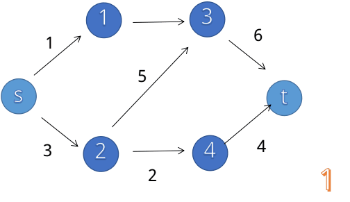
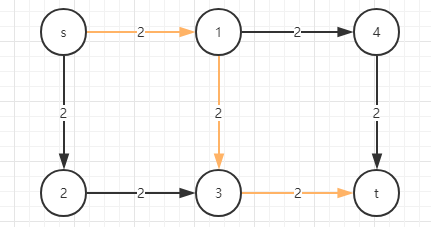
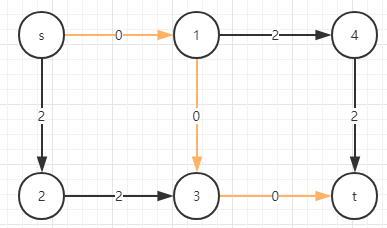
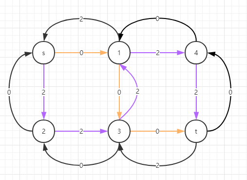
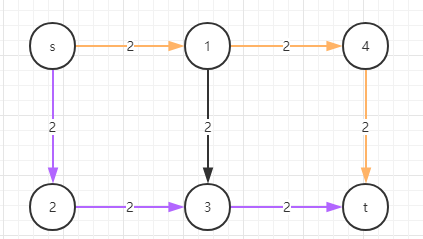
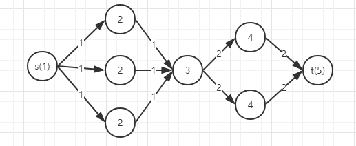
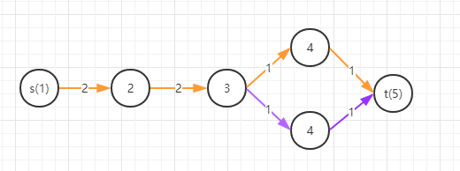

# 有源有汇上界最大流
找到一个方案使得网络流中的流量最大
# 增广路思想
算法基于**增广路定理**: 网络达到最大流当且仅当残留网络中没有增广路
>1.找到任意一条增广路
>
>2.找到$\min (cf(u,v))$ 记为 $flow$
>
>3.将增广路上的每一条边$cf(u,v)-=flow$对其反向边$cf(v,u)+=flow$
>
>4.重复上述步骤直到不存在增广路



## 反向边的意义

如果前面找的增广路不是最优解，那我们可以通过反向边走回去，相当于**反悔**

>以图为例
>
>
>
>第一次增广>$s \rightarrow 1 \rightarrow 3 \rightarrow t$
>
>松弛后得到
>
>
>发现无增广路，结果最大流为2
>
>结果显而易见是错的
>
>该图的最大流明显为
>
>$s \rightarrow 1 \rightarrow 4 \rightarrow t$
>
>$s \rightarrow 2 \rightarrow 3 \rightarrow t$
>
>结果最大流为4
>
>现在我们根据增广路思想建立反向边
>
>
>
>得到增广路 >$s \rightarrow 2 \rightarrow 3 \rightarrow 1 \rightarrow 4 \rightarrow t$
>
>结果最大流为4
>
>相当于
>
>
>

---

# Edmonds-Karp算法

## 思路

用增广路思想
每次在$G(V,E)$上进行广搜寻找**增广路**进行松弛

直到不存在增广路为止

复杂度$O(VE^2)$

## 代码

```cpp
const int N = 22;
const int M = 2222;
const int INF = 0x3f3f3f3f;

class Graphics{
private:
    struct Edge{
        int to, next, flow;
    }edge[M]; // 用链式前向星记录,flow为残量cf
    /* 
        first为链式前向星的头指针, sign为指向edge的移动指针
        preEdge为路径回朔记录该点是由哪条边过来的
        maxFlow为最大流答案
        surFlow为流流到该点所经过的边的最小残量min(cf(u,v))
    */
    int first[N], sign, preEdge[N], maxFlow, surFlow[N];
    bool vis[N];// vis标记广搜时该点是否已被访问
    int start, end;// start为源点s end为汇点t
    void addEdgeOneWay(int u, int v, int flow){ // 添加一条边，并且cf(u,v)=flow
        edge[sign].next = first[u];
        edge[sign].flow = flow;
        edge[sign].to = v;
        first[u] = sign ++;
    }
    bool bfs(){ // 广搜寻找增广路
        memset(vis, 0, sizeof(vis));
        queue<int> que;
        que.push(start);
        surFlow[start] = INF;// 源点还没经过任何边所以最小残量min(cf(u,v))是无穷的
        vis[start] = true;
        while(!que.empty()){
            int now = que.front();
            que.pop();
            for(int i = first[now]; i != -1; i = edge[i].next){
                int to = edge[i].to, flow = edge[i].flow;
                if(flow){
                    if(vis[to]) continue;
                    vis[to] = true;
                    surFlow[to] = min(surFlow[now], flow); //记录最小残量min(cf(u,v))
                    que.push(to);
                    preEdge[to] = i; // 记录路径
                    if(to == end) return true; // 广搜到汇点结束，说明有增广路
                }
            }
        }
        return false;// 找完所有情况无法到汇点，说明已经没有增广路
    }
    void update(){// 找到增广路后进行松弛，将增广路所有cf(u,v)-=flow, cf(v,u)+=flow，并更新结果maxFlow
        int now = end;
        while(now != start){
            int i = preEdge[now];
            edge[i].flow -= surFlow[end];
            edge[i^1].flow += surFlow[end];// 正向边与反向边是成对建的，所以(正向边^1=反向边)，(反向边^1=正向边)
            now = edge[i^1].to;
        }
        maxFlow += surFlow[end];
    }
public:
    Graphics(int s, int e){clear(s, e);}
    Graphics(){clear(1, 1);}
    void clear(int s, int t){// 初始化s为源点,t为汇点
        maxFlow = sign = 0;
        memset(first, 0xff, sizeof(first));
        start = s;
        end = t;
    }
    void addEdgeFlowWay(int u, int v, int flow){// 网络流边需增加残量为0的反向边
        addEdgeOneWay(u, v, flow);
        addEdgeOneWay(v, u, 0);
    }
    int edmondsKarp(){// 每次广搜找增广路后松弛，直到无法找到增广路，返回结果
        while(bfs()) update();
        return maxFlow;
    }
};
```

# Dinic 算法

## 思路

在Edmonds-Karp的基础上进行升级

Edmonds-Karp每次广搜只松弛一条增广路

而Dinic在广搜时标记每个点的bfs序

然后深搜进行松弛

>例如
>
>
>
>在一次广搜后相当于找到了多条增广路
>
>然后使用深搜进行多路增广即可
>
复杂度$O(V^2E)$

事实上实际运用远远达不到这个上界

并且在二分图最大匹配中时间复杂度为$O(E \sqrt{V})$实际表现更快

## 代码

```cpp
const int N = 22;
const int M = 2222;
const int INF = 0x3f3f3f3f;

class Graphics{
private:
    struct Edge{
        int to, next, flow;
    }edge[M]; // 用链式前向星记录,flow为残量cf
    int n;
    int first[N], sign; // first为链式前向星的头指针, sign为指向edge的移动指针
    int depth[N], cur[N]; // depth为bfs序, cur为弧优化
    int start, end;// start为源点s end为汇点t
    void addEdgeOneWay(int u, int v, int flow){// 添加一条边，并且cf(u,v)=flow
        edge[sign].next = first[u];
        edge[sign].flow = flow;
        edge[sign].to = v;
        first[u] = sign ++;
    }
    bool bfs(){// 广搜搜索增广路
        memset(depth, 0, sizeof(int)*(n+1));
        queue<int> que;
        que.push(start); depth[start] = 1;
        while(!que.empty()){
            int now = que.front();
            que.pop();
            for(int i = first[now]; i != -1; i = edge[i].next){
                int to = edge[i].to, flow = edge[i].flow;
                if(!depth[to] && flow){ // 如果该边残量cf(u,v)=0也就没有增广价值了
                    depth[to] = depth[now] + 1;
                    que.push(to);
                    if(to == end) return true;
                }
            }
        }
        return false;
    }
    int dfs(int now, int pFlow){// 单路增广+弧优化, pFlow为到now这个点所经过的边的min(cf(u,v))
        if(now == end) return pFlow;
        for(int &i = cur[now]; i != -1; i = edge[i].next){// 弧优化，意思是在本次单路增广结束后，下一次增广无需将边从头开始遍历，接上上一次增广路之后搜索即可
            int to = edge[i].to;
            if(depth[to] == depth[now] + 1 && edge[i].flow){
                int flow = dfs(to, min(edge[i].flow, pFlow));
                if(flow){// flow为now到源点t(end)时的pFlow，也就是min(cf(u,v))
                    edge[i].flow -= flow;//将增广路所有cf(u,v)-=flow, cf(v,u)+=flow
                    edge[i^1].flow += flow;// 正向边与反向边是成对建的，所以(正向边^1=反向边)，(反向边^1=正向边)
                    return flow;
                }
            }
        }
        return 0;
    }
public:
    Graphics(int s, int e){clear(s, e);}
    Graphics(){clear(1, 1);}
    void setN(int n){// 缩小初始化范围
        this->n = n;
    }
    void clear(int s, int t){// 初始化s为源点,t为汇点
        sign = 0;
        n = N - 1;
        start = s;
        end = t;
        memset(first, 0xff, sizeof(int)*(n+1));
    }
    void addEdgeFlowWay(int u, int v, int flow){// 网络流边需增加残量为0的反向边
        addEdgeOneWay(u, v, flow);
        addEdgeOneWay(v, u, 0);
    }
    int dinic(){// 一样的松弛增广路直到无增广路后返回结果
        int maxFlow = 0;
        while(bfs()){
            memcpy(cur, first, sizeof(int)*(n+1));
            while(int flow = dfs(start, INF)){
                maxFlow += flow;
            }
        }
        return maxFlow;
    }
};
```

## 多路增广

在上述代码中dfs的单路增广可以进一步优化为多路增广

上述代码中dfs在找到一条增广路后会先进行松弛，再寻找下一条增广路

可以在dfs搜到该点时的pFlow还没用完时直接进行下一条增广

>例如
>
>
>
>在**单路增广**中
>
>走完$s \rightarrow 2 \rightarrow 3 \rightarrow 4 \rightarrow t$**橙色线**后将直接对该增广路进行松弛
>
>然后再跑一遍dfs$s \rightarrow 2 \rightarrow 3 \rightarrow 4 \rightarrow t$**紫色线**对该增广路进行松弛
>
>而**多路增广**
>
>走完$s \rightarrow 2 \rightarrow 3 \rightarrow 4 \rightarrow t$**橙色线**松弛时发现在点$3$处$pFlow$还剩$1$
>
>进而走$3 \rightarrow 4 \rightarrow t$**紫色线**进行松弛
>

```cpp
    int dfs(int now, int pFlow){// 多路增广+弧优化, pFlow为到now这个点所经过的边的min(cf(u,v))
        if(now == end) return pFlow;
        int ret = 0;// 当前已流出量
        for(int &i = cur[now]; i != -1; i = edge[i].next){
            int to = edge[i].to;
            if(depth[to] == depth[now] + 1 && edge[i].flow){
                int flow = dfs(to, min(edge[i].flow, pFlow - ret)); // 下一个点可流量为当前点可流量 - 当前已流出量 pFlow - ret
                ret += flow; // 每次增广为该点更新已流出量
                edge[i].flow -= flow;
                edge[i^1].flow += flow;
                if(pFlow - ret == 0) break;
            }
        }
        if(!ret) depth[now] = -1;
        return ret;
    }
```